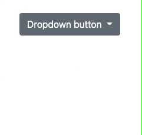

# React Dropdown Exercise

### Goal: Make a dropdown menu.

### Spec:
- On click, it should open the dropdown menu
- Second click should close it
- **Bonus - Optional only:** Clicking outside of the button, should also close it

### Expected result:



### Guidelines:
1. Make it look as close as possible to the expected result.
   
2. You need to have 4 components:
- `Dropdown` - Wraps everything
- `DropdownButton` - The button that opens/closes the dropdown menu
- `DropdownMenu` - The white box that opens when clicking `DropdownButton`
- `DropdownItem` - An item in the `DropdownMenu`

3. Make it generic! The user might want to have several dropdown across his app.
Take in consideration that every dropdown may contain different items.

---

### Setup

1. Fork this repository (click on the Fork button at the top of the screen).
2. Clone this repository:
    ```
    $ git clone <url>
    $ cd react-dropdown
    ```

3. Install dependencies:
    ```
    npm install
    ```

4. After that's done, run this to start development:
    ```
    npm start
    ```


Good luck!
